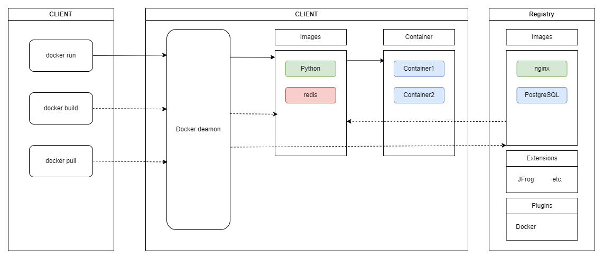
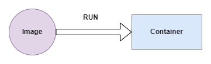
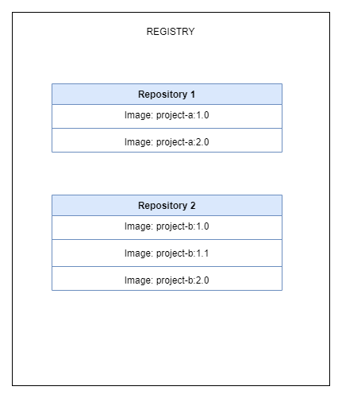

## What is Docker?

It's platform that allows build, test and deploy applications quickly.

Docker packages software into _containers_ that got everything the software need to run(libs, code, runtime).

_container_ - is loosely isolated environment, possible to share between different OS

## Docker architecture

- it uses client-server architecture
- *Client(docker)* talks to the *Docker deamon*, *Docker deamon(dockerd)* listens for Docker API requests
- *Docker deamon* is responsible for building, running and disturbing Docker containers
- Docker client and Docker deamon can run on the same system, or we can connect Docker client to remote Docker deamon
- *Docker registry* stores Docker images. [Docker Hub](https://hub.docker.com/) is example of public registry, we can also use private registry

### Core components of Docker

#### Container

Container is isolated process for each component(frontend - Angular, backend - Spring Boot, database - each run on its own isolated environment). It contain all dependencies required to execute the contained software application.

Each container is:
- self-contained - have everything it needs to function
- isolated - minimal influence on the host and other containers
- independent - deleting one component doesn't affect other
- portable - working anywhere

Multiple containers share the same kernel

### Container vs Virtual Machines(VMs):

- Both of them are virtualized(it's process in which system resources like RAM, CPU, Disk, Networking can be virtualized)

#### Difference between container and VM:
- VM virtualize entire machine down to hardware layer, container only virtualize layers above operating system

---

### Image

- Image includes all necesary files, binaries, libraries and configuration to run a container

#### Important!
- Images are immutable. Once created cannot be modified, you need to create new image
- Images are composed of **layers**. Each layer represents set of file system changes

---

### Registry

- Image registry is a centralized location for storing and sharing container images
- It can be *public* or *private*

Public container registers:
- [Amazon Elastic Container Registry](https://aws.amazon.com/ecr/)
- [Azure Container Registry](https://azure.microsoft.com/en-in/products/container-registry)

Private containers for local system or organization:
- [JFROG Artifactory](https://jfrog.com/artifactory/)
- [GitLab container registry](https://docs.gitlab.com/ee/user/packages/container_registry/)

_Repository_ and _Registry_ are not the same(they can be used interchangeable). _Registry_ is **centralized location** that stores and manages images. _Repository_ is collection of related container images within a registry(Think of _repository_ as folder where are necesary images based on project)

### Docker Compose

- it is YAML file where defining running containers
- best practise is to divide containers where each container doing one thing